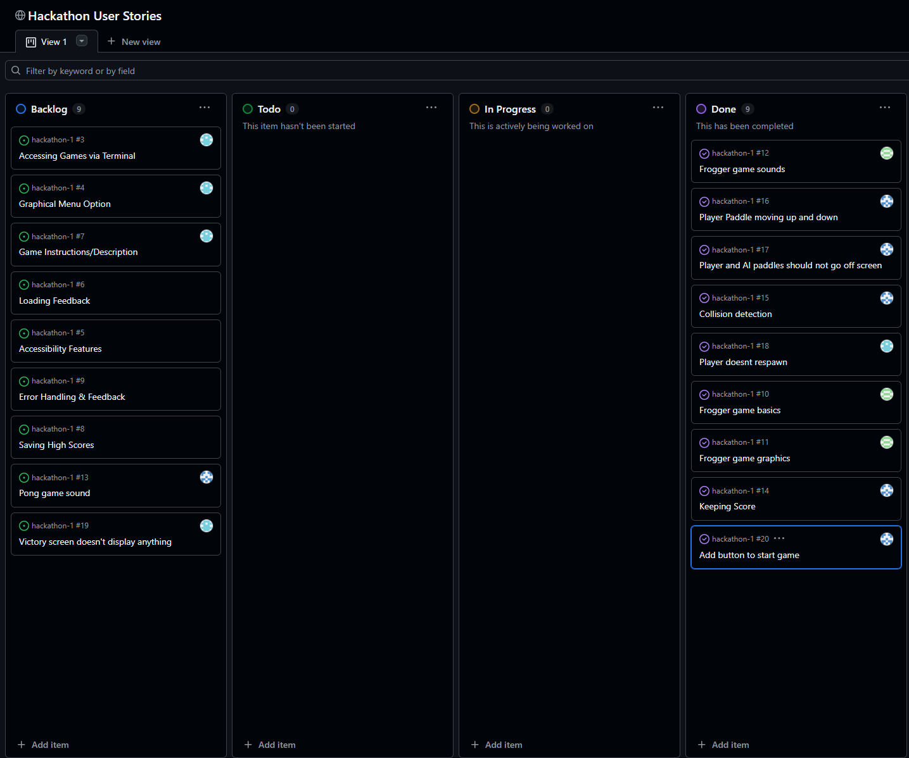
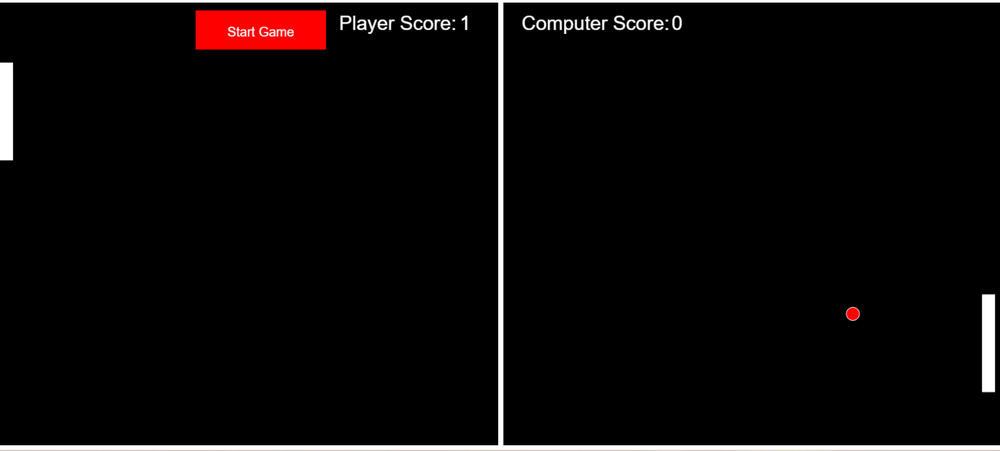
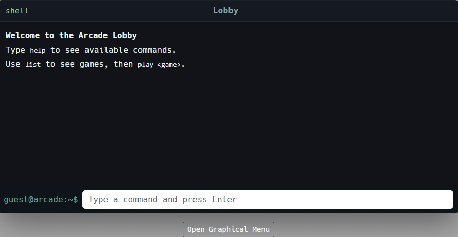
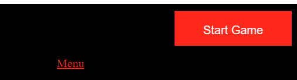

# Hackathon title

> An arcade baked into a terminal interface, explore our three blast from the past classic recreations. From a game based on the classic Frogger, a Worlds Hardest Game callback, or back to the old faithful with classic pong.

This website serves as a base for 3 minigames made over the course of 3 days. These minigames are accesed on the main page through a terminal style interface. We wanted to capture some of the games we were fond of on our youth. As well as this, we wanted to give an added sense of nostalgia through interacting with a command line interface.

## Table of Contents

-   [Hackathon title](#hackathon-title)
    -   [User Experience (UX)](#user-experience-ux)
        -   [User Stories](#user-stories)
    -   [Early Design](#early-design)
        -   [Early Design Pong](#early-design-pong)
        -   [Early development of Car Crosser](#early-development-of-car-crosser)
    -   [Features](#features)
        -   [Arcade Homepage](#arcade-homepage)
        -   [Fully-Functional Games](#fully-functional-games)
            -   [Zipbomb](#zipbomb)
            -   [Frogger](#frogger)
            -   [Pong](#pong)
        -   [Navigation & User Experience](#navigation--user-experience)
    -   [Design Philosophy](#design-philosophy)
    -   [Testing](#testing)
        -   [Manual Testing](#manual-testing)
        -   [Browser Validation](#browser-validation)
    -   [Known Bugs](#known-bugs)
    -   [Future Improvements](#future-improvements)
    -   [Technologies and References](#technologies-and-references)
    -   [Deployment](#deployment)
    -   [Credits](#credits)

## User Experience (UX)

### User Stories

-   As a user, I want to access multiple games from a single homepage so I can easily choose what to play.
-   As a user, I want each game to be visually consistent and easy to understand.
-   As a user, I want the site to work well on both desktop and mobile devices.
-   As a user, I want to see my score or progress in each game.
-   As a user, I want to return to the arcade menu from any game.

    Here are some more of our user stories, we used the Kanban board on github.
    

## Early Design

We initially started with the terminal homepage as a connector for the site games. Then we each worked individually on our own pages, fleshing out our games in isolation.

Early development of zipbomb:

[^1]

[^1]: Prototype image: the player being the red ball; enemy = blue ball; coin = yellow ball.

Most of the time was spent on the foundational elements, including

1. collision detection
2. a level builder
3. per-level enemy AI programming

Once these elements were in place, focus was shifted towards graphics and audio implementation.

## Early Design Pong

For my game design, I just decided to stick with the classic game of pong, black background, two white paddles, white boundary lines and white center white line.

I first got a ball bouncing on screen, I followed some tutorials and read documentation for canvas on to draw the ball and make it move, when I was happy with that I added the black background and made the ball red to make it stand out.

I then drew the center line and added two rectangle paddles to the canvas

I then drew two boundary lines on the canvas and that was it the design was done and it was time to implement game features. I also added player and computer score text which increment when either player or computer score and added a button which starts the game.

I spent the most time on the AI player, trying to improve it, by not making it to hard or to easy.

## Early development of Car Crosser:

Initially the game was designed to be like the game frogger, but over time the game turned into a game where you are a car driving while avoiding oncoming cars.

Early development included:

1. Creating a square the user could control with the keyboard.
2. Creating other shapes that moved around the screen acting as obstacles.
3. Create events when the player square collided with an obstacle shape.

## Features

### Arcade Homepage

…

### Fully-Functional Games

…

#### Zipbomb

#### Frogger

#### Pong

### Navigation & User Experience

Main Lobby
Navigation in the main lobby is quite intuitive. The interface is designed in the shape of a shell, where users can type one of two commands: "help" to see available options, or "list" to view all games. After that, users can type the name of the game they want to play and press Enter. Alternatively, they can use the graphical menu below the shell and select a game by clicking. This design provides a smooth and intuitive user experience.

Pong
Navigation for pong is simple, there is a start button to start the game. There is also a menu button which will take you back to the home page so you can select to play another game.

-   **Accessibility options**: graphical game menu
-   …

## Design Philosophy

-   **Layout and Navigation**:…
-   **Color scheme**:
    -   …
-   **Typography**:…

## Testing

### Manual Testing

…

### Browser Validation

…

## Known Bugs

Pong

-The main bug in pong is the AI paddle is very janky movement wise and is to easy to play against.

…

## Future Improvements

I want to make the following future improvements for Pong:

-   Improve the AI and not have it so janky.
-   Add buttons to set number of games the player wants to play.
-   Add a reset button to reset game and start over.
-   Add buttons or a slider to make the game harder, increase ball speed etc.
-   Make where the ball bounces more unpredictable and random.
-   Have the ability to drop in more balls.
-   Add sound effects when the ball bounces off walls or the player or AI score.

Car Crosser:

1. Adding a difficultly setting to the main menu which would increase the oncoming cars speeds or make the cars themselves bigger.
2. Adding a score leaderboard based on how long you drove before crashing.
3. Have the car turn when the user drives left or right. (Would be challenging due to changes in collision)

## Technologies and References

For this project we used the following technologies

-   HTML 5 Canvas
-   Javascript
-   CSS

We used vscode as our code editor of choice.

We watched tutorials on Canvas that Stephen told us about by chris cross that were really helpful in getting started with canvas.

[Watch this video](https://youtu.be/EO6OkltgudE?si=tpG6Lds2HoD6zsKk)

We also read documentation about canvas provided by MDN which also aided us in making our games.
[Canvas API – MDN Documentation](https://developer.mozilla.org/en-US/docs/Web/API/Canvas_API)

…

## Deployment

## Credits

---
