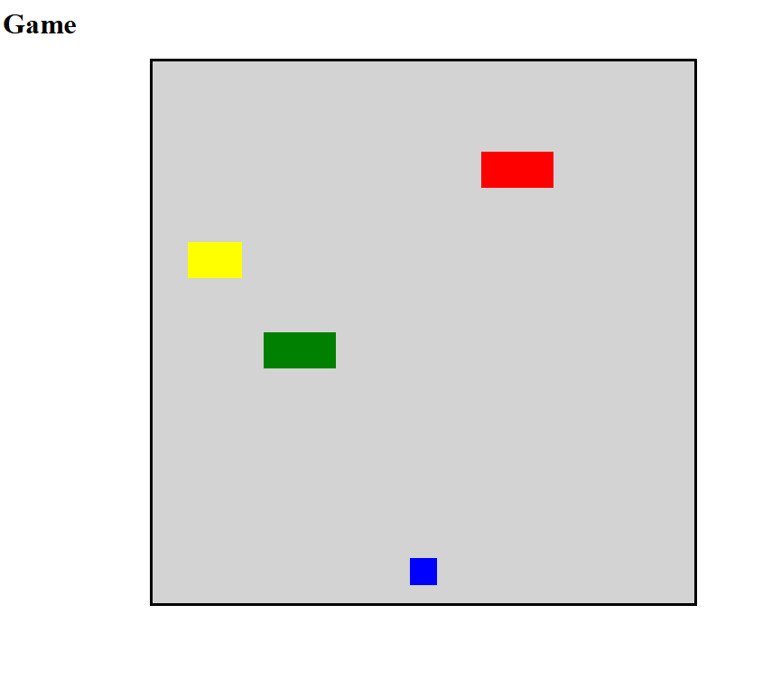
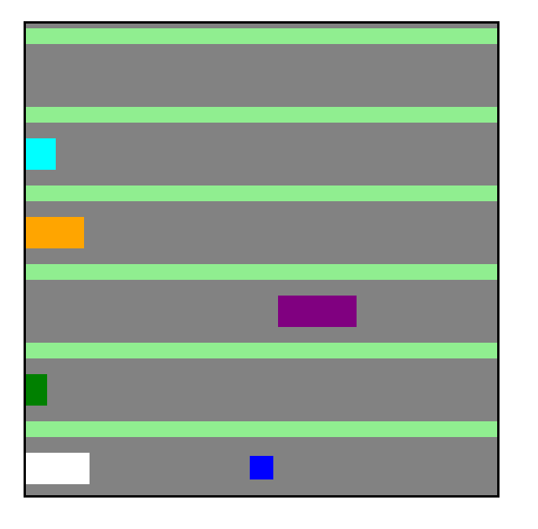
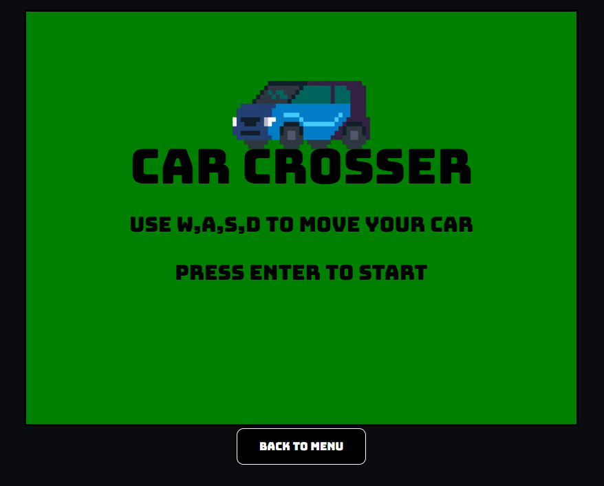
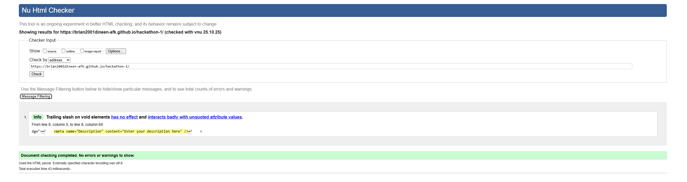
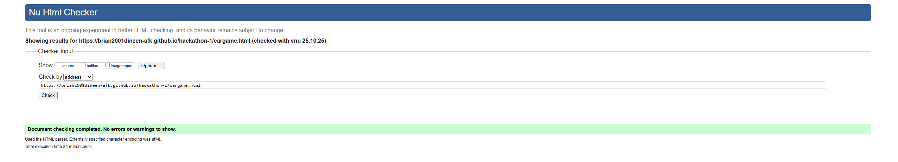
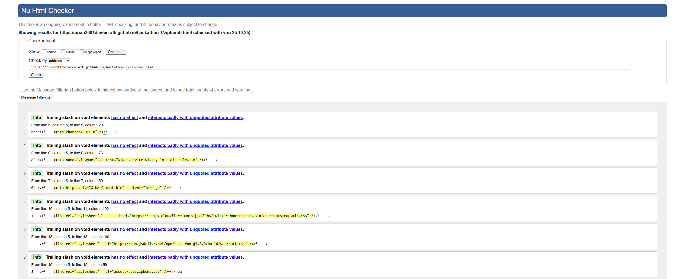
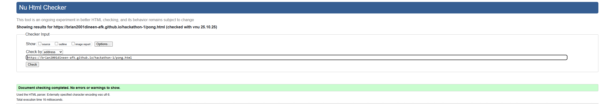
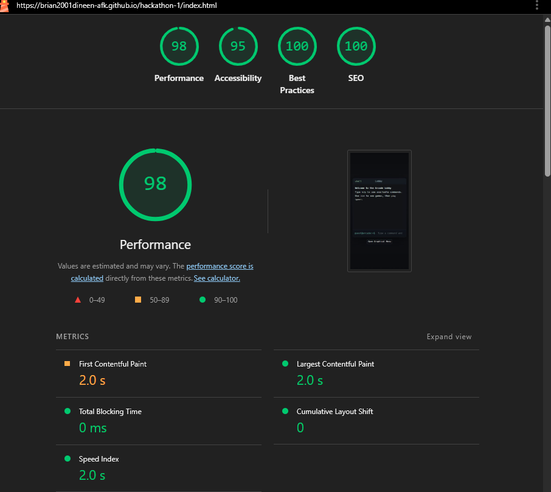

# CodeInstitute Group Hackathon Project - Arcade Minigames

> An arcade baked into a terminal interface, explore our three blast from the past classic recreations. From a game based on the classic Frogger, a Worlds Hardest Game callback, or back to the old faithful with classic pong.

This website serves as a base for 3 minigames made over the course of 3 days. These minigames are accesed on the main page through a terminal style interface. We wanted to capture some of the games we were fond of on our youth. As well as this, we wanted to give an added sense of nostalgia through interacting with a command line interface.

> [!NOTE]
> You can access the live site [here](https://brian2001dineen-afk.github.io/hackathon-1/).

---

## Table of Contents

1.  [User Experience (UX)](#user-experience-ux)
    -   [User Stories](#user-stories)
2.  [Early Design](#early-design)
    -   [Early Design Pong](#early-design-pong)
    -   [Early development of Car Crosser](#early-development-of-car-crosser)
3.  [Features](#features)
    -   [Arcade Homepage](#arcade-homepage)
    -   [Fully-Functional Games](#fully-functional-games)
        -   [Zipbomb](#zipbomb)
        -   [Frogger](#frogger)
        -   [Pong](#pong)
    -   [Navigation & User Experience](#navigation--user-experience)
4.  [Design Philosophy](#design-philosophy)
5.  [Testing](#testing)
    -   [Manual Testing](#manual-testing)
    -   [Browser Validation](#browser-validation)
6.  [Appendix](#appendix)
    -   [Known Bugs](#known-bugs)
    -   [Future Improvements](#future-improvements)
    -   [Technologies and References](#technologies-and-references)
    -   [Deployment](#deployment)
    -   [Credits](#credits)

---

## User Experience (UX)

### User Stories

-   As a user, I want to access multiple games from a single homepage so I can easily choose what to play.
-   As a user, I want each game to be visually consistent and easy to understand.
-   As a user, I want the site to work well on both desktop and mobile devices.
-   As a user, I want to see my score or progress in each game.
-   As a user, I want to return to the arcade menu from any game.

Here are some more of our user stories, we used the Kanban board on github.

---

## Early Design

We initially started with the terminal homepage as a connector for the site games. Then we each worked individually on our own pages, fleshing out our games in isolation.

Early development screenshot of zipbomb:

> Prototype image: the player being the red ball; enemy = blue ball; coin = yellow ball.

Most of the time was spent on the foundational elements, including

1. collision detection
2. a level builder
3. per-level enemy AI programming

For this particular game, the limitations of canvas became apparent later on in development, mainly that it would be much smoother to use text directly for the games graphical interface, rather than trying to emulate a vim environment in canvas. After this early version was prototyped, the game was rewritten from the ground up.

> Prototype image: the assets were converted to text characters and were styled to match the previous theme.

After the base rewrite, more emphasis was focused on utilizing the text medium to the games advantage, including

-   ASCII art for some of the level design
-   Font options to change graphics without introducing blurriness or compression
-   Lightweight performance on GPU-limited machines

## Early Design Pong

For my game design, I just decided to stick with the classic game of pong, black background, two white paddles, white boundary lines and white center white line.

I first got a ball bouncing on screen, I followed some tutorials and read documentation for canvas on to draw the ball and make it move, when I was happy with that I added the black background and made the ball red to make it stand out.

I then drew the center line and added two rectangle paddles to the canvas

I then drew two boundary lines on the canvas and that was it the design was done and it was time to implement game features. I also added player and computer score text which increment when either player or computer score and added a button which starts the game.

I spent the most time on the AI player, trying to improve it, by not making it to hard or to easy.

## Early Design Car Crosser

Initially the game was designed to be like the game frogger, but over time the game turned into a game where you are a car driving while avoiding oncoming cars.

Early development included:

1. Creating a square the user could control with the keyboard.
2. Creating other shapes that moved around the screen acting as obstacles.
3. Create events when the player square collided with an obstacle shape.

First I made a square which could be moved around the canvas with the wasd keys and added other moving shapes which bounced across the screen.

I then inplemented collision detection between the player and the other moving shapes. I then made the other shapes scroll and loop across the canvas, also added some roads and a background.

---

## Features

-   **Arcade Menu:** Homepage listing all available games.
-   **Individual Games:**
    -   Zipbomb
    -   Carcrosser
    -   Pong
-   **Back to Menu:** Easy navigation to return to the arcade homepage.
-   **Lightweight:** No login or backend required.

### Arcade Homepage

The homepage acts as the central hub for the arcade. It uses a terminal-style interface where users can type commands such as `help`, `list`, or the name of a game to launch it. For users who prefer clicking, a graphical menu is also provided below the terminal. From this page, players can easily access all available games. Each game has a button or function to go back and return to it at any time.

…

### Fully-Functional Games

### Zipbomb

-   **Description:** Navigate a text characeter through maze-like levels all within a vim emulation, avoiding enemies with movement and collecting coins to beat levels.
-   **Controls:**
    -   Standard Vim `h,j,k,l` keys OR arrow keys for movement.
    -   `H-L` to go back or forward a level, respectively.
-   **Objective:** Collect all coins and make it to the exit to complete levels.
-   **Features:** Multiple levels, general enemy AI, collision detection, and level progression.

### Frogger / Car Crosser

-   **Description:** Drive a car across lanes of traffic without crashing into oncoming cars.
-   **Controls:** `w,a,s,d` keys for movement.
-   **Objective:** Drive for as long as possible without crashing.
-   **Features:** Increasing difficulty, moving obstacles, simple scoring.

### Pong

-   **Description:** Classic pong game with player vs computer.
-   **Controls:** Arrow keys or `w,s` to move your paddle.
-   **Objective:** Score more points than the computer.
-   **Features:** AI opponent, score tracking, start/reset buttons, simple sound effects.

---

## Navigation & User Experience

### Main Lobby

Navigation in the main lobby is quite intuitive. The interface is designed in the shape of a shell, where users can type one of two commands: "help" to see available options, or "list" to view all games.

After that, users can type the name of the game they want to play and press Enter. Alternatively, they can use the graphical menu below the shell and select a game by clicking. This design provides a smooth and intuitive user experience.

#### Car Crosser

Car crosser navigation is done using the large button below the canvas which will take the user back to the main menu if they should choose. All user navigation within the actual game is done with key presses which are display in the game at the appropriate times.

#### Pong

Navigation for pong is simple, there is a start button to start the game. There is also a menu button which will take you back to the home page so you can select to play another game.

-   **Accessibility options**: graphical game menu
-   …

---

## Design Philosophy

-   **Layout and Navigation**:…
-   **Color scheme**:
    -   …
-   **Typography**:…

---

## Testing

### Manual Testing

…

### Browser Validation

-   lobby.html
    
-   cargame.html
    
-   zipbomb.html
    
-   pong.html
    

-   Lighhouse
    

---

# Appendix

## Known Bugs

#### Pong

-   The AI paddle is very janky movement-wise, and is too easy to play against.
-   …

## Future Improvements

I want to make the following future improvements for Pong:

-   Improve the AI and not have it so janky.
-   Add buttons to set number of games the player wants to play.
-   Add a reset button to reset game and start over.
-   Add buttons or a slider to make the game harder, increase ball speed etc.
-   Make where the ball bounces more unpredictable and random.
-   Have the ability to drop in more balls.
-   Add sound effects when the ball bounces off walls or the player or AI score.

#### Car Crosser

1. Adding a difficulty setting to the main menu which would increase the oncoming cars speeds or make the cars themselves bigger.
2. Adding a score leaderboard based on how long you drove before crashing.
3. Have the car turn when the user drives left or right. (Would be challenging due to changes in collision)

---

## Technologies and References

For this project we used the following technologies

-   HTML 5 Canvas
    - We watched tutorials on Canvas that Stephen told us about by Chris Cross that were really helpful in getting started with canvas. [Watch this video](https://youtu.be/EO6OkltgudE?si=tpG6Lds2HoD6zsKk)
    - We also read documentation about canvas provided by MDN which also aided us in making our games. [Canvas API – MDN Documentation](https://developer.mozilla.org/en-US/docs/Web/API/Canvas_API)
-   Javascript
-   CSS
-   IDE: VSCode
- …

## Deployment

This project is deployed using **GitHub Pages**.

1. We pushed the completed project to GitHub in a public repository.
2. In **Repository Settings → Pages**, we selected the `main` branch and set the root (`/`) folder as the publishing source.
3. GitHub Pages automatically built and deployed the site.
4. The live link is now accessible at:  
   `https://<username>.github.io/<repository-name>/`

### Notes

-   Any time we push new commits to the `main` branch, the site redeploys automatically.
-   GitHub Pages is a good fit because the project is static (HTML/CSS/JS) and doesn’t require a backend or server-side processing.

## Credits

These games were coded by the team members Brian, Stephen and Kevin.
- Some of the ASCII art used in Zip-Bombs levels was taken and generated using [asciiart.eu](https://www.asciiart.eu/) and [textartcopy.org](https://textartcopy.org/small/).
